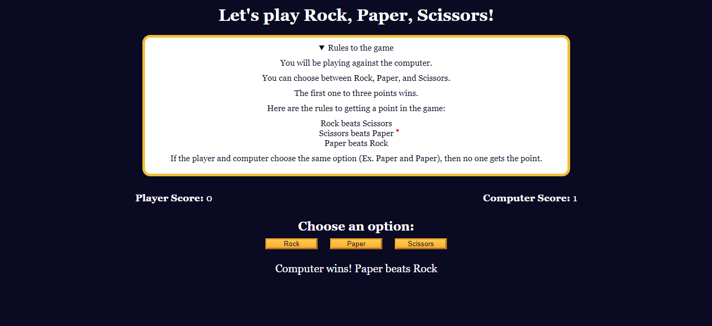

# Rock, Paper, Scissors Game ✊✋✌️
Experience the excitement of a classic game with our interactive Rock, Paper, Scissors web game! 🌟 Built using HTML, CSS, and JavaScript, this game brings the traditional hand game to life in a fun and engaging format.

How to Play:

The game pits you against the computer in a simple yet thrilling contest of choice. You can select between three options: Rock (✊), Paper (✋), or Scissors (✌️).
The rules are straightforward:
Rock crushes Scissors (Rock wins) ✊✌️.
Scissors cut Paper (Scissors win) ✌️✋.
Paper covers Rock (Paper wins) ✋✊.
If both you and the computer choose the same option, it's a tie! 🤝
Game Mechanics:

Each round, the computer randomly selects its move, and the game evaluates the outcome based on the rules above. 🎲
The game keeps track of the scores for both you and the computer, with the first player to reach three points declared the winner. 🏆
After a winner is determined, a reset button will appear, allowing you to easily start a new game. 🔄
With its simple interface and engaging gameplay, this Rock, Paper, Scissors game is perfect for players of all ages. Whether you’re looking for a quick distraction or a challenge to test your luck and strategy, this game is sure to entertain! 🎉
